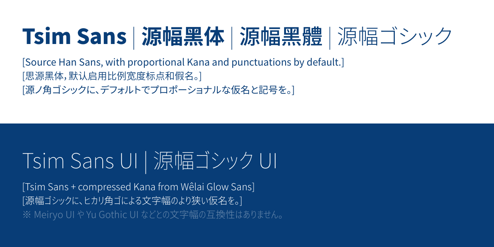
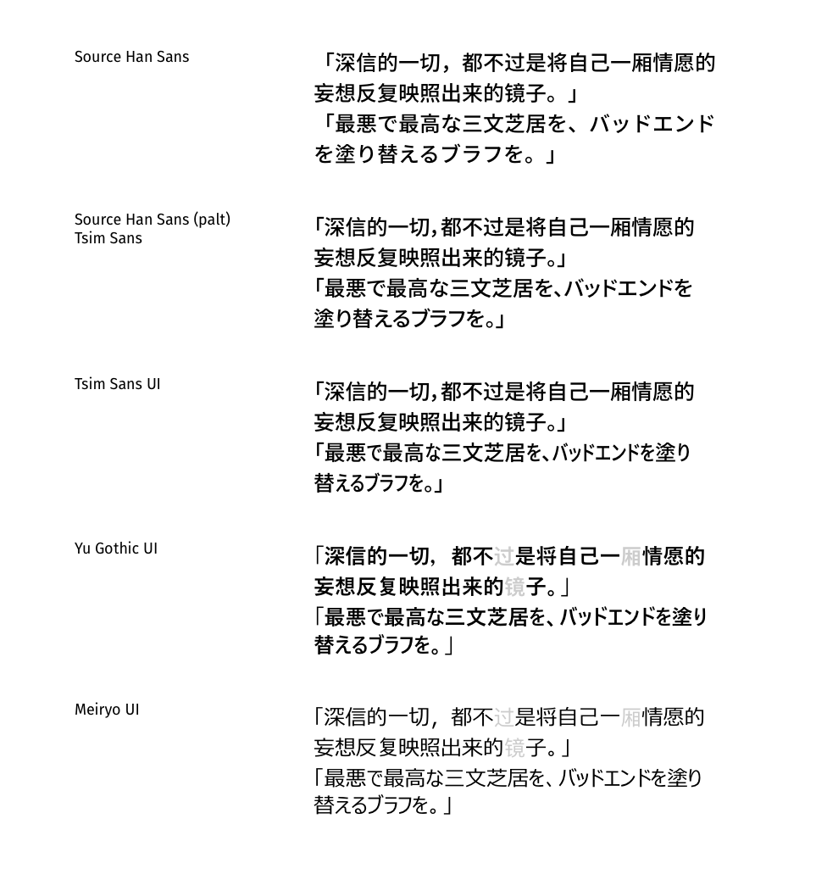

# Tsim Sans | 源幅黑体 | 源幅黑體 | 源幅ゴシック

> *tsim* n. source



**Tsim Sans** is a simple modification on [Source Han Sans](https://github.com/adobe-fonts/source-han-sans) that bakes the “Alternative Proportional Width” OpenType feature (`palt`) of the typeface into the default metrics. This project is designed for use cases where OpenType features is not an option due to technical limitations, yet still would prefer a proportional punctuations and Kana design.

源幅黑体是一个对于思源黑体的简单修改：将「比例标点和假名宽度」OpenType 特性（`palt`）设定为字体的默认量度。本项目是为一些无法调用 OpenType 特性却希望使用比例宽度设计的情况设计的。

源幅（ゲンフク）ゴシックは、源ノ角ゴシックを簡単に改変した派生書体です。源幅ゴシックはノ角ゴシックの「プロポーショナル仮名・記号」の OpenType 機能（`palt`）をデフォルト文字幅に変更しました。OpenType 機能を利用できない場合でプロポーショナルフォントを利用したい方のために作成しました。完全版の源ノ角ゴシックをベースにしたので、中国語（簡・繁体字）や韓国語にしかないグリフでも一つのファイルで対応できます。（但し地域別のグリフ表示は OpenType 機能対応が必要）

**Tsim Sans UI**, based on Tsim Sans, added compressed Kana glyphs from [Wêlai Glow Sans](https://github.com/welai/glow-sans). The UI variant of this typeface is designed for Japanese language use cases where the UI wasn’t designed well for localization, and compromises from the string / typeface side is needed.

源幅ゴシック UI は、源幅ゴシックの上にさらにヒカリ角ゴ Compressed の仮名部分を導入し、Windows の UI フォントの雰囲気をだすことができます。ローカライズ面でうまくでサインされたプログラムやゲームなどに長い日本語を入れてはみだすことを避けたい場合も利用できます。

※ Meiryo UI や Yu Gothic UI などとの文字幅の互換性はありません。




*21% of space is saved by converting from Source Han Sans to Tsim Sans UI.*

## Build 构建 ビルド
To build this project, you first need to get ready the following tools in your `PATHS`.

若需要构建此项目，请先将下列工具准备在 `PATHS` 下面。

このプロジェクトをビルドするには、以下のツールを `PATHS` にて用意してください。

* [otfcc](https://github.com/caryll/otfcc) (`otfccbuild`, `otfccdump`)
* [aria2](https://aria2.github.io/) (`aria2c`)
* [Python 3](https://www.python.org/) (`python3`)

Then run the following command to build the project.

然后运行如下指令构建此项目。

そして、以下のコマンドを実行し、本プロジェクトをビルドする。

```bash
python3 build.py
```

## License 授权 ライセンス

Font files are released in SIL Open Font License 1.1, build related code is released in MIT License.

字体文件以 SIL Open Font License 1.1 发布，此仓库中构建字体开发的代码以 MIT License 发布。

フォントファイルは SIL Open Font License 1.1 で公開されています。また、ソースコードは MIT License です。

> * Wêlai Glow Sans © 2020 Project Wêlai, released under SIL OFL 1.1.
> * `kana.tsv`, extracted from GitHub.com/welai/glow-sans, released under MIT License.
> * Source Han Sans Copyright 2014-2021 Adobe, released under SIL OFL 1.1.